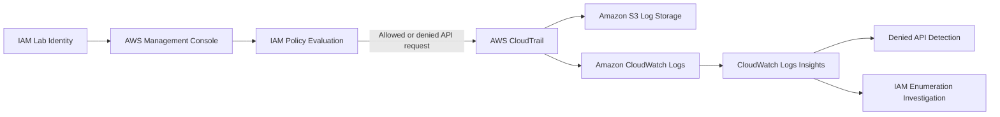

# Architecture

## Overview

This lab used AWS CloudTrail to record AWS management events and Amazon
CloudWatch Logs to search and investigate those events. Least-privilege IAM
permissions were applied to the lab identity to validate that unauthorized API
requests were denied and logged.

## Components

| Component | Purpose |
|---|---|
| IAM | Managed the lab identity and enforced least-privilege permissions |
| CloudTrail | Recorded AWS management events across multiple Regions |
| Amazon S3 | Stored CloudTrail log files |
| CloudWatch Logs | Received CloudTrail events for centralized monitoring and query analysis |
| CloudWatch Logs Insights | Queried denied API activity and IAM enumeration events |

## Event Flow

1. An IAM identity signs in to the AWS Management Console.
2. The console makes AWS API requests on behalf of the identity.
3. IAM evaluates whether an identity-based policy allows the requested action.
4. CloudTrail records the management event, including the principal, API action,
   Region, source service, and authorization outcome.
5. CloudTrail delivers configured events to Amazon S3 and CloudWatch Logs.
6. CloudWatch Logs Insights searches the log group for denied API activity and
   IAM enumeration patterns.

## Lab Evidence

- The CloudTrail trail was configured as a multi-Region trail.
- IAM global-service events, including `ListUsers`, `ListGroups`, and `ListRoles`,
  were observed in `us-east-1`.
- A console-initiated `ec2:DescribeRegions` request was denied in `us-east-2`.
- The denied request returned `Client.UnauthorizedOperation` because no
  identity-based policy allowed `ec2:DescribeRegions`.

## Architecture Diagram

## Security Controls

- Multi-Region CloudTrail management-event logging
- Least-privilege IAM policy assignment
- CloudTrail delivery to centralized log storage
- CloudWatch Logs Insights queries for investigation
- Sanitization of account-specific information before publishing evidence
